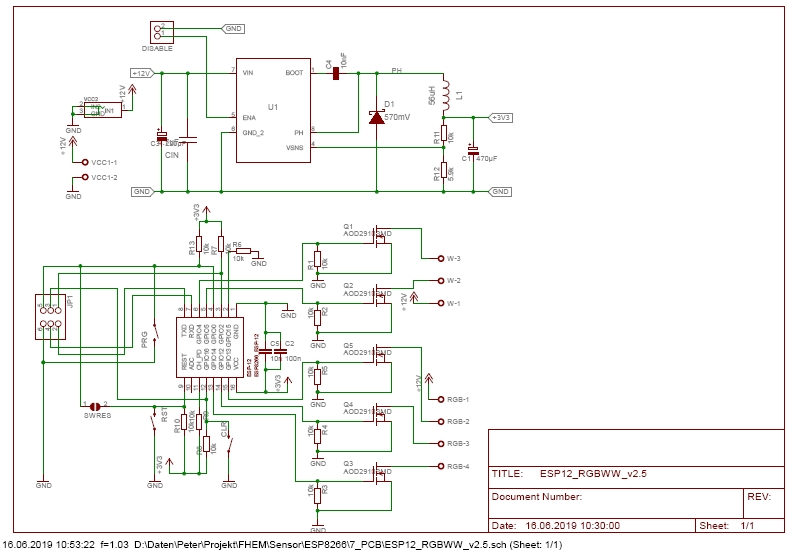

This project is a fork of [patrickjahns](https://github.com/patrickjahns) and [pljakobs](https://github.com/pljakobs) version of the RGBWW controller PCB on [github](https://github.com/pljakobs/esp_rgbww_controller/tree/3382119fb962fafa23e8ef6323f3a7b23ad8b1d9).

# ESP8266 WiFi RGBWW LED dimmer
Custom hardware board for controlling 5 LED channels via PWM (RGB + warm/cold white). It is designed for max current ~6.5 A per channel ([thoughts on max. current](https://forum.fhem.de/index.php/topic,101240.msg947190.html#msg947190)).

# Changelog

* v2.5 (changes to the [production version of the PCB](https://github.com/pljakobs/esp_rgbww_controller/tree/3382119fb962fafa23e8ef6323f3a7b23ad8b1d9) by PeMue)
  * sort schematic, add frame
  * slight geometry change of holes to fit [Strapubox CO4 case](http://strapubox.de/modules/uploadmanager11/admin/index.php?action=file_download&file_id=140&location_id=0)
  * change geometry to fit also [Strapubox 515 case](http://strapubox.de/wcms/ftp//s/strapubox.de/uploads/515.pdf) (smaller part of PCB)
  * add 5x2.5 DC jack connector for direct connection of a power supply (parallel to 2-pin terminal block)
  * connect reset pin via solder jumper to GPIO0
  * add version number to PCB
  * schematic
    
  * layout (top)
    
  * layout (bot) 
    

# Assembly
Assembly of the PCB board is straight forward, solder all parts to the PCB:

## Parts
- 1x diode B160-13-F (D1)
- 1x power inductor NPI75C560KTRF 56 µH (L1)
- 1x DC/DC converter TPS5410DR (U1)
- 1x ESP8266-ESP12
- 5x AOD2910 MOSFET (logic level gate threshold)
- 12x 10 kohm resistors, 0805 (R1 - R11, R13)
- 1x 5.9 kohm resistor, 0805 (R12)
- 1x 4.7 µF capacitor 12o6 (CIN)
- 1x 330 µF electrolytic capacitor RM 2.5 mm (C1) 
- 1x 220 µF electrolytic capacitor RM 2.5 mm (C3)
- 1x 100 nF capacitor 0805 (C2)
- 2x 10 nF capacitor 0805 (C4, C5)
- 1x 5.08 mm 4-pin terminal block (RGB)
- 1x 5.08 mm 3-pin terminal block (W)
- 1x 5.08 mm 2-pin terminal block (VCC1)
- __or:__ replace 1x 2-pin terminal block by 1x 5x2.5 DC jack (VCC2)
- 1x 2.54 mm 2-pin header (DISABLE)
- 1x 2.54 mm 6-pin header for GIPOO access (JP1)
- 3x micro SMD tactile switch 2-pin 3*6*2.5 mm (CLR, PRG, RST)

### Recommended steps
- close solder jumper if you want to have RESET connected to a GPIO (for software reboot)
- start with soldering SMD capacitors, diode and resistors
- solder power inductor and DC/DC converter
- solder SMD tactile switches
- solder eletrolytic capacitors
- solder 2-pin terminal blocks __or__ DC jack
- __check__ the correct output voltage of the DC/DC converter 
- solder ESP8266 module 
- solder FETs
- solder remaining terminal blocks and pin headers

# Pictures

# Firmware
Latest discussion for the firmware (including links) can be found in [FHEM forum](https://forum.fhem.de/index.php/topic,70738.0.html).

# Modification
The schematic and board files are compatible with EAGLE v6.x.

# Resources
* [ESP RGB project](https://github.com/RiRomain/esp-dimmer-hardware)
* [H801 Wifi controller hack](http://chaozlabs.blogspot.de/2015/08/esp8266-in-wild-wifi-led-controller-hack.html)
* [previous version of the hardware](https://github.com/pljakobs/esp_rgbww_controller/tree/3382119fb962fafa23e8ef6323f3a7b23ad8b1d9)
* [firmware](https://github.com/verybadsoldier/esp_rgbww_firmware)
* for documentation purposes: [online check of MD files](https://dillinger.io/)

# Thread in FHEM forum
* [ESP RGBWW Wifi Led Controller - Support Thread](https://forum.fhem.de/index.php/topic,101240.msg946874.html#msg946874)

# Credits
Thanks to RiRomain for his excellent documented [ESP RGB Project](https://github.com/RiRomain/esp-dimmer-hardware).
Thanks to [patrickjahns](https://github.com/patrickjahns) and [pljakobs](https://github.com/pljakobs) for their excellent work on the previous versions of the hardware.
Thanks to [vbs](https://github.com/verybadsoldier) for the excellent work and maintaining of the firmware.
