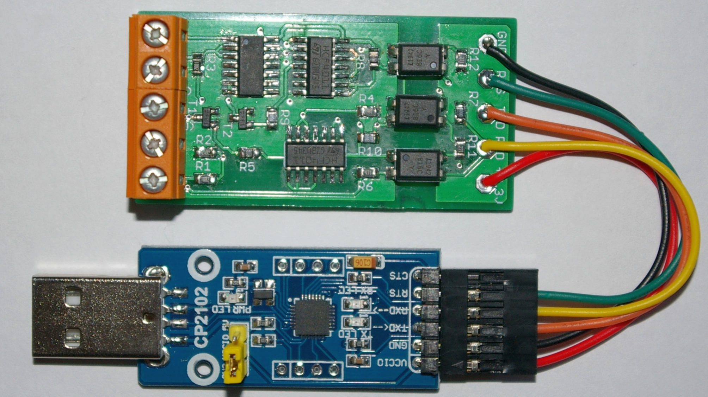
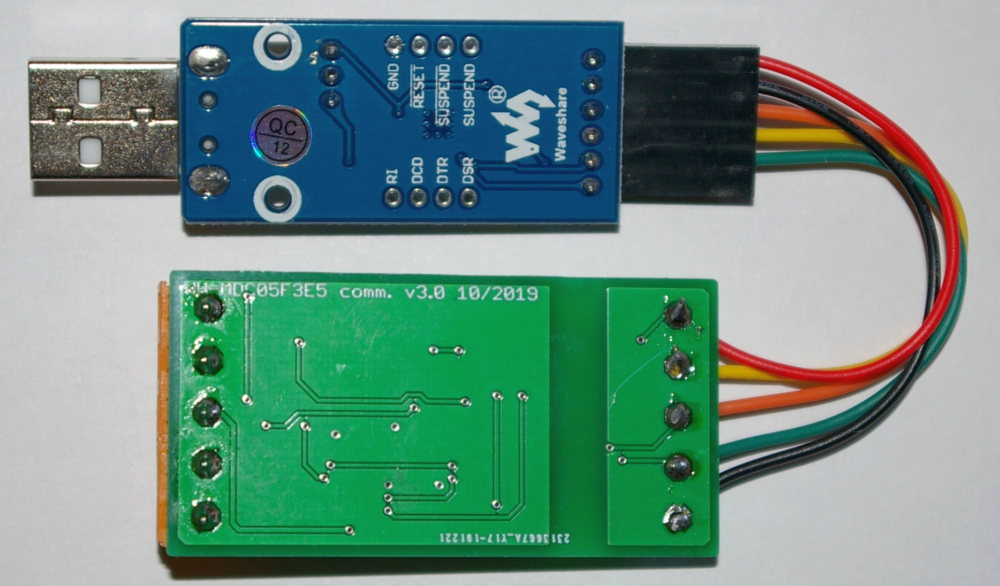

# Communication PCB for a Panasonic heat pump
Communication PCB for a Panasonic [WH-MDC05f3e5](http://aquarea.smallsolutions.de/index.php?title=WH-MDC05f3e5) heat pump also called "Geisha". This PCB is based on a schematic posted [here](https://forum.fhem.de/index.php/topic,80916.msg879068.html#msg879068).

# Changelog

* v2.0 (throughole version)
  * based on this [schematic](https://forum.fhem.de/index.php/topic,80916.msg879068.html#msg879068)
  * added static signal on unused gates
  * schematic
    

* v3.0 (SMD version)
  * all parts changed to SMD
  * layout top
  
    
  * layout bottom
  
    
  * assembled PCB and USB2serial converter
    

  * assembled PCB and USB2serial converter (Waveshare)
    

  * assembled PCB and USB2serial converter (bottom view)
    

  * [schematic](WH-MDC05F3E5_comm_v3.0_sch.pdf)
  * [gerber files](gerber/WH-MDC05F3E5_comm_v3.0_gerber.zip)
  * [bill of material](WH-MDC05F3E5_comm_v3.0_bom.xls)

# Assembly
__CAUTION__: Pin 1 marking of 4011B is a chamfer at the IC package, indicating the position of pin 1 (chamfer at the left).  
Necessary for the communication is an USB2serial converter (needed signals: 3.3 V, GND, RxD, TxD and __RTS__). The controller chip needs to be a [CP2102](https://www.silabs.com/documents/public/data-sheets/CP2102-9.pdf) and __RTS__ pin needs to be available. The baud rate needs to be set to [960 baud](https://forum.fhem.de/index.php/topic,80916.msg729625.html#msg729625).
An example for a suitable USB2serial converter is [here](https://www.reichelt.de/entwicklerboards-microusb-buchse-auf-uart-cp2102-debo-musb2uart-2-p266052.html?CCOUNTRY=445&LANGUAGE=de&trstct=pos_0&nbc=1&&r=1).

# Modification
The schematic and board files are compatible with EAGLE v6.x.

# Resources
* [WH-MDC05f3e5 documents](http://aquarea.smallsolutions.de/index.php?title=WH-MDC05f3e5#Links_zu_Original_Dokumenten)
* [WiFi module for WH-MDC05f3e5](https://www.haustechnikdialog.de/Forum/t/181931/Intensishome-Wifi-Modul-in-Kombination-mit-der-Panasonic-WH-MDC05F3E5-Geisha) and discussion in Haustechnik Forum
* [PCB hardware discussion](https://forum.fhem.de/index.php/topic,104628.msg985249.html#msg985249) in FHEM forum
* [setup of communcation PCB](https://forum.fhem.de/index.php/topic,80916.msg729625.html#msg729625) in FHEM forum
* [FHEM control](http://aquarea.smallsolutions.de/index.php?title=Steuerung_via_FHEM) in aquarea forum
* [FHEM module](https://github.com/der-lolo/aquarea)
* [Tweakers forum](https://gathering.tweakers.net/forum/list_message/64194378#64194378) (NL)
* for documentation purposes: [online check of MD files](https://dillinger.io/)
