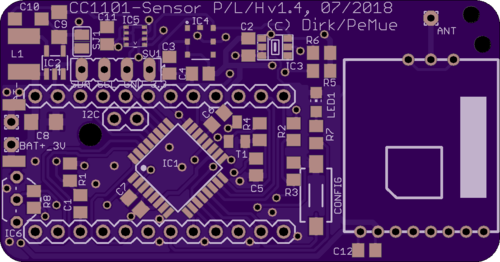

# Homematic
This repository contains several PCBs for Homematic sensors for usage outside (*Aussensensor*).

## Aussensensor
This layout is based on Dirk's *Universalsensor* described [here](https://wiki.fhem.de/wiki/Universalsensor).

v1.2 schematic of the layout can be found [here](https://github.com/kc-GitHub/Wettersensor/blob/master/Schematic/Universal-Sensor_Atmega328.sch) and board [here](https://github.com/kc-GitHub/Wettersensor/blob/master/Schematic/Universal-Sensor_Atmega328.brd).

v1.2 gerber files can be found [here](Aussensensor_v1.2_gerber).

### Changelog

* v1.3 (06/15/2018, PeMue)
  * GDO2 of CC1101 module connected to D3
  * BME280 added (temperature, pressure, humidity)

* v1.4 (07/09/2018, PeMue)
  * GDO2 removed, added additional capacitor to CC1101 module
  * DS18B20 and pullup to 3.3 V connected to D3, supply voltage is 3.3V
  * added additional tantalum capacitor to MAX1724 output
  * changed pinout of I2C connector to match pinning of MAX44009 light sensor module
  * added SJ2 for battery voltage measurement w/o battery load
  * layout (top)
    
  * layout (bot) 
    